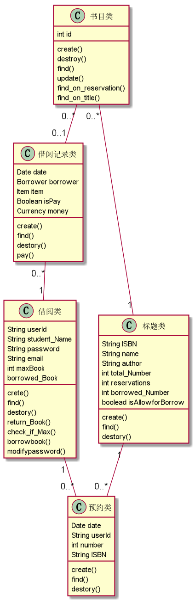

|学号|班级|姓名|
|:-------:|:-------------: | :----------:|:---:|
|201510414401|软工四班|陈惠翔|

# 1. 图书管理系统的类图

## 1.1. 类图PlantUML源码如下
<pre>
@startuml
class 书目类{
    int id
    {method} create()
    {method} destroy()
    {method} find()
    {method} update()
    {method} find_on_reservation()
    {method} find_on_title()
}
class 借阅记录类{
    Date date
    Borrower borrower
    Item item
    Boolean isPay
    Currency money
    {method} create()
    {method} find()
    {method} destory()
    {method} pay()
    }
class 借阅类{
    String userId
    String student_Name
    String password
    String email
    int maxBook
    borrowed_Book
    {method} crete()
    {method}find()
    {method}destory()
    {method}return_Book()
    {method}check_if_Max()
    {method}borrowbook()
    {method}modifypassword()
}
class 预约类{
    Date date
    String userId
    int number
    String ISBN
    {method}create()
    {method}find()
    {method}destory()
}
class 标题类{
    String ISBN
    String name
    String author
    int total_Number
    int reservations
    int borrowed_Number
    boolead isAllowforBorrow
    {method}create()
    {method}find()
    {method}destory()
}
书目类 "0..*" -- "1" 标题类
书目类 "0..*" -- "0..1" 借阅记录类
借阅记录类"0..*" -- "1" 借阅类
标题类"1"--"0..*"预约类
借阅类"1"--"0..*"预约类
@enduml
</pre>
## 1.2. 类图如下

## 1.3. 类图说明
该类图由“借阅者”，“预约类”，“书目类”，“标题类”，“借阅记录类”等实体类构成，之间由聚集，组合等关系相关联，类图中是该类的各种属性

# 2. 图书管理系统的对象图

## 2.1. “标题类”的对象图
源码如下
<pre>
@startuml
Object 标题类{
条形码：▏▍▎▊▌▋▉▏▏▏
ISBN：99937-0-014-2
名字：《活着》
作者：余华
总共数量：30
预约数量：2
已借出数量：10
是否允许借出：是
}
@enduml
</pre>

对象图如下

## 2.2. “书目类”的对象图
源码如下
<pre>
@startumlObject 标题类{
Object 书目类{
ID：123
}
@enduml
</pre>

对象图如下

## 2.3. “预约类”的对象图
源码如下
<pre>
@startuml
Object 预约类{
预约日期：2018-5-1
借阅者ID：201510414401
预约数量：2
ISBN：999 1 0-125-7
}
@enduml
</pre>

对象图如下

## 2.4.“借阅类”的对象图
源码如下
<pre>
@startuml
Object 借阅类{
用户ID：201510414401
名字：JasonChenhx
密码：****
email：chx880324@163.com
最多可借图书数量：10
已借图书：《活着》—余华、《许三观卖血记》—余华
}
@enduml
</pre>

对象图如下

## 2.5. “借阅记录”的对象图
源码如下
<pre>
@startuml
Object 借阅记录{
借阅时间：2018-4-13
价钱：38元
是否已支付：是
书目类：社会类
借阅者：JasonChenhx
}
@enduml
</pre>

对象图如下

